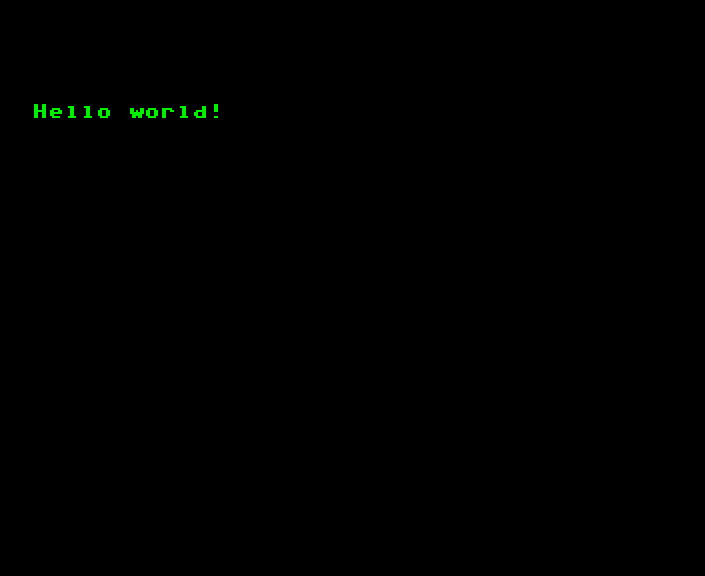
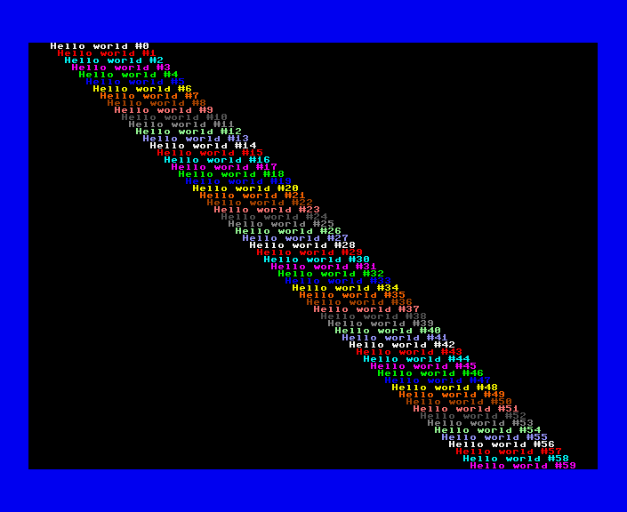
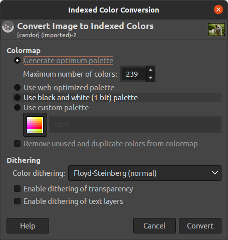
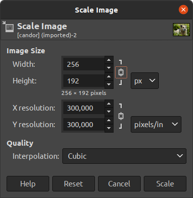
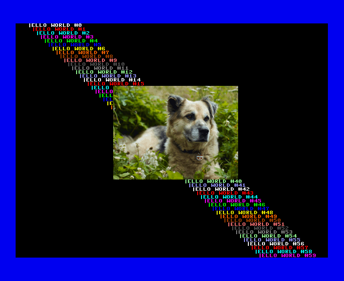

# FCIO Tutorial

## Preface: What is FCIO?

*fcio* is a lightweight C library providing full colour mode support for C developers on the MEGA65:

- standard text input/output facilities (fc_puts, fc_printf, fc_input...)
- text window support (fc_makewin, fc_setwin...)
- dynamically loading and displaying bitmap images (fc_loadFCI, fc_displayFCI...)
- palette manipulation (fc_loadPalette, fc_setPalette, fc_fadePalette...)
- and some various other bells and whistles

Since *fcio* is now a part of [mega65-libc](https://github.com/MEGA65/mega65-libc), I figured people might be interested in how to load and display pictures and text using the fcio library. So this is a little tutorial showing how to accomplish exactly that.

## What is Full Colour Mode?

Full Colour Mode (FCM for short) is a new screen mode of the MEGA65's video controller (the VIC-IV). Full Colour Mode allows you to  mix text and 24 bit graphics on the same screen, as well as performing all kinds of neat tricks with the display, such as overlaying additional content, flipping and mirroring character cells and much more.

Since in FCM, each 8x8 pixel character cell on the screen is referenced by a 16 bit pointer, it is not compatible to 'traditional' C64 text modes and therefore not accessible via standard console libraries, such as mega65-libc's own *conio.h*. This is where *fcio* comes in.

Please note that at the moment, FCIO "only" supports displaying graphics and text, but this might very well change in the future.

# The Tutorial

## 1. Hello FCIO

Let's start with something really simple: Switching the screen to full colour mode and displaying some text. In order to do so, simply clone the mega65-libc to a convenient location, type in the following code and save it at **test.c**.

```c
#include <fcio.h>

void main() {
   fc_init(0,0,0,0,0);
   fc_puts("Hello world!");
   while(1);
}
```
Assuming you have the mega65-libc in the same folder as the test program, compile your program with

```
cl65 -Imega65-libc/cc65/include -o test test.c mega65-libc/cc65/src/fcio.c mega65-libc/cc65/src/memory.c
```

(you need to compile both `fcio.c` and `memory.c`, because `fcio.c` depends on `memory.c`. In the later stages of this tutorial, we'll use `SCons` to do the grunt work for us; but for now, calling CC65's compile and link utility `cl65` directly will suffice)

After `cl65` has done its magic, there should be a new `test` binary in your current folder. You can now transfer it to your MEGA65 using your trusty `m65` utility like so:

```
m65 -4 test -l /dev/ttyUSB2
```

or, if your MEGA65 got stuck in the mail, fire up your xemu emulator:

```
xemu-xmega65 -prg ./test
```

In any case, the result should be the same: A green 'hello world' on a black background.

<br/>

Not much to look at, you might think, but you have just successfully initialized a full colour mode screen and put some text on it. Now, let's make things a little bit more interesting, shall we?

## 2. Configuring the screen

At initialization time, there is a lot of things going on behind the scenes. 
The prototype of `fcio_init` is:

```c
void fc_init(byte h640, 
             byte v400, 
             fcioConf *config, 
             byte rows, 
             char *reservedBitmapFile);
```

So, when initializing the library with `fc_init(0,0,0,0,0)`, here is what actually happens:

- the H640 and V400 flags are set to 0, giving us a low resolution (320x200) screen.
- by passing "0" as the "config" parameter, the standard memory configuration is selected (fcio allows you to place bitmap and character data anywhere in memory, but it can also handle those things for you when you pass '0')
- by passing "0" as the "rows" parameter, a standard screen with 25 character rows is created. Unlike the C64, the MEGA65 allows arbitrary screen configurations. In PAL mode, it is possible to have up to 33 character rows in non-V400 modes
- and finally, by passing "0" as the reservedBitmapFile parameter, no reserved bitmap is loaded at initialization. Don't worry about that now, we'll be looking at reserved bitmaps later.

So, with that knowledge, it's quite easy to set up a high resolution screen with a few extra columns to play with:

```c
#include <fcio.h>
#include <conio.h>

void main() {
   byte i;
   fc_init(1,1,0,60,0);
   bordercolor(6);
   for (i=0;i<60;++i) {
      fc_textcolor(1+(i%14));
      fc_gotoxy(i,i);
      fc_printf("Hello world #%d",i);
   }
   while(1);
}
```
There are a few things noteworthy about this program:

1. We include the `conio.h` header, because we're using the `bordercolor`function to change the border colour. This shows that `conio.h` and `fcio.h` are able to coexist (in fact, some portions of `fcio.h` depend on `conio.h`). Just don't think about mixing `conio`s text output functions to display text on a full colour screen (and vice versa) – it won't work and will most probably lead to sad things™.

2. You can use `fc_printf` just like you would use the regular `printf` function. It accepts the same variable arguments and acts just like its `stdio.h` counterpart. 

Compile and link the program again. Before running it, remember to set your MEGA65 to operate in PAL mode, as NTSC mode doesn't provide quite enough resolution for a screen with 60 text rows.

Assuming all went well, you should now see something like this:

<br/>

Now we're talking! 60 rows of text in high resolution. 

To be perfectly honest, this would also have been possible with standard character mode. So, it's time we unleashed FCIOs full power by displaying some pretty bitmap graphics.

But before we can do just that, we first have to take care of getting some pretty bitmap graphics onto the MEGA65, preferrably in a form that FCIO understands.

## 3. How to get bitmap images onto the MEGA65

`fcio` internally uses an image format called `.FCI` (for *full colour image*). There is nothing magical about `.FCI` images – they just have their bitmap data arranged in a way that the VIC-IV can easily display, so `fcio` doesn't need much code to load and display them which means more real estate for your programs. 

There is a python tool `png2fci` available for converting PNG files to FCI images. It is available [here](https://raw.githubusercontent.com/MEGA65/mega65-tools/master/src/tools/png2fci.py).

### 3.1. Excursion: Organizing things (at least a little bit)

At this point, it's prudent to clean up our project a little, so that we don't run into troubles later on. I suggest the following folder structure (we're going to use the various subfolders in the further course of this tutorial):

```
fciotutorial/     
     |
     |--- test.c                 the main tutorial test program
     |
     |--- tools/                 tools needed to build project resources
     |      |----- png2fci.py
     |
     |--- mega65-libc/           the mega65 C library including FCIO
     |
     |--- res/                   any resources the final program is going to use
     |
     |--- img-src/               source PNG images
     |
     |--- c65-bin/               additional binaries for C65 mode
     |
     |--- bin/                   the compiled binary lives here
     |
     |--- disc/                  place for .d81 disc images
```

Before continuing with this tutorial, download `png2fci.py` and put it into your `tools` folder.

### 3.2 Provide an indexed PNG with suitable dimensions

Since the VIC-IV is a palette based chip, we need a source image that is indexed. If we want to keep things simple, we need a picture using a maximum of 239 colours (the VIC-IV uses colour index 255 for a special purpose, and while it's perfectly possible to overwrite the system palette of colours 0-15, we don't want to do so just yet. This leaves 239 usable palette entries).

Fortunately, there's a wide range of software which allows us to convert about any image into the desired shape. In this tutorial, we'll use GIMP, but of course any commercial software or subscription rip-off will do just as nicely.

To get started, Let's take this JPEG image of Candor, my trusty co-developer (or really any other JPEG you want):

<br/>

Right-click on the image and save it somewhere, then open it up with GIMP. 

The first thing we have to do is to convert this image from RGB to indexed colour. So, in GIMP select "Image -> Mode -> Indexed..." in the menu, which brings up this dialog:

<br/>

Make sure to convert the image to a maximum of 240 colours (remember, we want to keep the system colours). 

After converting the image to indexed colour, there's one last thing we need to change: The image is way too big for displaying it on the MEGA65. Let's scale it down to a more MEGA65 friendly size by selecting "Image -> Image size" and then requesting an image size of 256x192 pixels:

<br/>

**Important**: Both width and height of the image *need* to be a multiple of 8. That's because the VIC-IV displays bitmap images via 8x8 pixel character cells.

### 3.3 Converting PNG to FCI images

With this friendly word of caution out of the way, we can now save the image (be sure to save the image as PNG, because that's the only format `png2fci` understands) and convert it with the `png2fci` utility. 

Assuming your PNG file is named `candor.png`, call:

```
tools/png2fci.py -rv img-src/candor.png res/candor.fci
```

Without any options, `png2fci` simply converts the PNG into an FCI. We are using the **-r** and **-v** flags here to reserve the first 15 colours, and to display some info about the conversion, respectively. If all goes well, `png2fci` should display

```
### png2fci v1.0 ###
reading candor.png
infile size is  256 x 192 pixels
reserving system colour space
outfile has 255 palette entries
using 24 rows, 32 columns.
building outfile
done.
```
## 4. Displaying bitmap images

Now it's time to expand our little program from section #2 to load and display our newly created FCI image:

```c
#include <fcio.h>
#include <conio.h>

void main() {
   byte i;
   long t;
   fc_init(1,1,0,60,0);
   bordercolor(6);
   fc_clrscr();
   for (i=0;i<60;++i) {
      fc_textcolor(1+(i%14));
      fc_gotoxy(i+3,i);
      fc_printf("Hello world #%d",i);
   }
   fc_displayFCIFile("candor.fci",25,16);
   while(1);
}
```

Notice the single line that's been added? `fc_displayFCIFile()` is really all we need to display an FCI file on the screen. Noice.

You can now compile the program again using roughly the same command as before, only this time we store the resulting binary in the `bin` folder.

```
cl65 -Imega65-libc/cc65/include -o bin/test test.c mega65-libc/cc65/src/fcio.c mega65-libc/cc65/src/memory.c
```

But don't fire up your MEGA65 (or emulator) just yet, because obviously we're not quite done yet. We first need to provide the MEGA65 with a disc image to load the FCI file from. 

### 4.1 Building the disc image

The easiest way to do so is to use the `c1541` tool, which is part of the VICE emulator suite. 

To create a .d81 image (currently the only type of image the MEGA65 can handle), type:

```
c1541 -format fcdemo,sk d81 disc/fcioDemo.d81
```

This will create an empty `fcioDemo.d81` disc image in the `disc` directory. You can now copy the necessary files to the image via:

```
c1541 disc/fcioDemo.d81 -write bin/test
```

and

```
c1541 disc/fcioDemo.d81 -write res/candor.fci
```

So, finally we have a disc image with both the binary and the picture file to load. Mount it on your MEGA65, change to C64 mode (we have to start CC65 binaries from C64 mode) and load it with `LOAD "TEST"`. *Et voilà:*

<br/>

You have just configured a MEGA65 FCM screen and displayed some text and a pretty picture on it... with just 16 lines of code!

## 5. Excursion: Making life easier

At this point, manually invoking the compiler and linker, running png2fci and building a new disc image whenever something has changed has become a little bit of a nuisance.

The usual way to deal with this problem is the use of *Makefiles*. Now in my humble opinion, Makefiles are a hostile and unreadable monstrosity, which is why I like to use *SCons* instead. 

### 5.1 SCons to the rescue

[*SCons*](https://scons.org/) is a software construction tool, just like *make*. One of the major differences is that *SConstruct* files (the equivalent to Makefiles) are actually python scripts, so they are much easier to read and to maintain. 

Assuming we still have our main `test.c` program in the same directory as `mega65-libc`, and we want to have the finished binary in a `bin` subdirectory create the following file and save it as `SConstruct`:

```py
import os

env = Environment(
    ENV={'PATH': os.environ['PATH']},
    CPPPATH='mega65-libc/cc65/include',
    CC='cl65')

test = env.Program('bin/fcdemo.c64', [
    'test.c',
    'mega65-libc/cc65/src/memory.c',
    'mega65-libc/cc65/src/conio.c',
    'mega65-libc/cc65/src/fcio.c'
])
```

Now, calling `scons` will take care of compiling and linking our program into `bin/fcdemo.c64` whenever anything in the list of source files  has changed. 

But we still haven't solved the problem of creating the rest of the files and bundling them together on a disc image. 

### 5.2 Automating `png2fci` and `c1541`

Fortunately, these tasks are relatively easy to automate with a shell script. 

To convert all the PNG files in the folder `img-src` into FCI images and store them in the `res` folder, one would write

```sh
for filename in img-src/*.png; do
  python3 tools/png2fci.py -vr $filename res/$(basename $filename .png).fci
done
```

Then, to automatically build a disc image containing the binary and the converted image files,

```sh
DISCNAME="fcdemo.d81"

mkdir -p disc
c1541 -format fcdemo,sk d81 disc/$DISCNAME

for filename in res/*; do
  c1541 disc/$DISCNAME -write $filename
done

c1541 disc/$DISCNAME -write bin/fcdemo.c64
```

### 5.3 Adding the wrapper 

One unfortunate aspect of working with CC65 is that there is still no C65 compatible runtime, so programs have to be started in C64 mode.

While this is in itself no problem (all MEGA65 features are available from the C64 configuration), it introduces one additional when starting the program, and it might lead to newcomers regarding the resulting code as inferior because "it doesn't run in MEGA65 mode" or something like that.  

A workaround for this problem is the "c65toc64wrapper" program, available [here](https://files.mega65.org?id=b6ebf79e-6b8b-4562-b79a-59e73d10ac7b), to which you can append your CC65 program in order to make it launchable from C65 mode. This is most easily accomplished with the `cat` command:

```
cat c65bin/c65toc64wrapper.prg bin/fcdemo.c64 > bin/autoboot.c65
```

Calling the finished (wrapped) program `autoboot.c65` has the advantage that the MEGA65 will start it automatically when booting from our disc image.

### 5.4 Putting it all together

Combining image conversion, wrapping and disc image creation results in the following shell script:

```sh
#!/bin/sh

set -e
DISCNAME="fcdemo.d81"

cat c65bin/c65toc64wrapper.prg bin/fcdemo.c64 > bin/autoboot.c65

mkdir -p res
for filename in img-src/*.png; do
  echo $filename
  python3 tools/png2fci.py -vr $filename res/$(basename $filename .png).fci
done

mkdir -p disc
c1541 -format fcdemo,sk d81 disc/$DISCNAME

for filename in res/*; do
  c1541 disc/$DISCNAME -write $filename
done

c1541 disc/$DISCNAME -write bin/autoboot.c65
```

Save this script in `tools/buildDisc.sh`. 

Now all that's left to do is to tell `scons` to invoke the `buildDisc.sh` script after successful compilation of our program. This is easily done by adding a *postAction* to our build, so the complete SConstruct file looks like this:

```py
import os

env = Environment(
    ENV={'PATH': os.environ['PATH']},
    CPPPATH='mega65-libc/cc65/include',
    CC='cl65')

test = env.Program('bin/fcdemo.c64', [
    'test.c',
    'mega65-libc/cc65/src/memory.c',
    'mega65-libc/cc65/src/conio.c',
    'mega65-libc/cc65/src/fcio.c'
])

buildDiscAction = Action('tools/buildDisc.sh')
env.AddPostAction(test, buildDiscAction)
```

Now, call `scons -c` to clean up anything that may be left from previous experiment, and then again without the `-c` parameter, to start our build process. The output should read something like

```
stephan@ammonia:~/devel/tut$ scons
scons: Reading SConscript files ...
scons: done reading SConscript files.
scons: Building targets ...
cl65 -o test.o -c -Imega65-libc/cc65/include test.c
cl65 -o mega65-libc/cc65/src/memory.o -c -Imega65-libc/cc65/include mega65-libc/cc65/src/memory.c
cl65 -o mega65-libc/cc65/src/conio.o -c -Imega65-libc/cc65/include mega65-libc/cc65/src/conio.c
cl65 -o mega65-libc/cc65/src/fcio.o -c -Imega65-libc/cc65/include mega65-libc/cc65/src/fcio.c
cl65 -o bin/fcdemo.c64 test.o mega65-libc/cc65/src/memory.o mega65-libc/cc65/src/conio.o mega65-libc/cc65/src/fcio.o
tools/buildDisc.sh
img-src/candor.png
### png2fci v1.0 ###
reading img-src/candor.png
infile size is  256 x 192 pixels
reserving system colour space
outfile has 255 palette entries
using 24 rows, 32 columns.
building outfile
done.
formatting in unit 8 ...
writing file `CANDOR.FCI' as `CANDOR.FCI' to unit 8
writing file `AUTOBOOT.C65' as `AUTOBOOT.C65' to unit 8
scons: done building targets.
```

And there we have it: With one simple call of `scons`, you can now compile your sources and build the disc image in one go. 

With the tedious stuff out of the way, we're now ready to dive a little deeper into FCIO!

